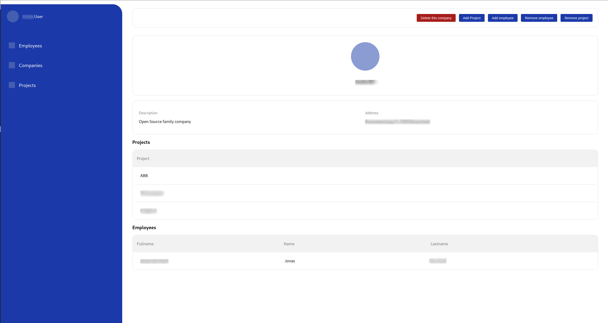
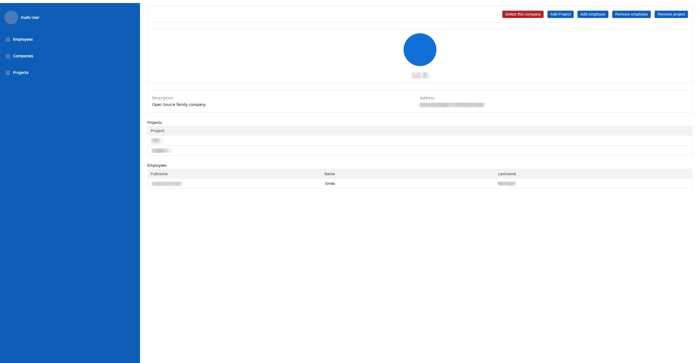

# Portfolio Manager

The Linked Data Portfolio Manager is a powerful and intuitive tool designed to streamline the process of creating and managing employee portfolios within an organization. It serves as a centralized hub where companies, projects, and employees are interconnected through a sophisticated network of links, allowing for seamless collaboration and project tracking.

## Setup

This project exists out of a frontend & backend. Both repostiories you can find here:

- https://github.com/JonasVanHoof/portfolio-manager-frontend
- https://github.com/JonasVanHoof/portfolio-manager-backend

A `makefile` is created to start the frontend running on the backend application network, the mapped volume as root and the ports to expose it on 4200. These can all be set by adding a `.env` file to the root of your project and defining the values. The code block below is an example of the valuesset in the `.env` file.

```yaml
DOCKER_BUILD_NAME=localhost/portfolio-manager-frontend
DOCKER_BUILD_PATH=.
DOCKER_FRONTEND_RUN_PORT=4200
DOCKER_FRONTEND_VOLUME_TO_COPY=./
DOCKER_BACKEND_NETWORK=portfolio-manager
```

After these values have been set you can build the project with `make build` and start it afterwards with `make start`. Behind the makestart command is just a docker run command with the specifications that we need. These specifications are defined with the `.env` variables.

## Visuals

### V1

With own styling


### V2

Styled following the specifications of [ember-appuniversum](https://appuniversum.github.io/ember-appuniversum/?path=/story/outline-getting-started--page)

